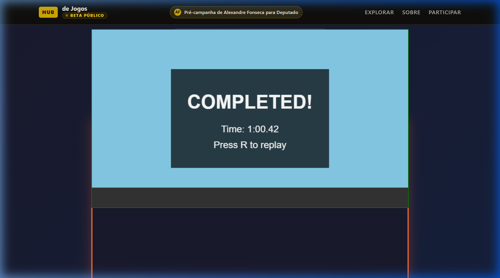
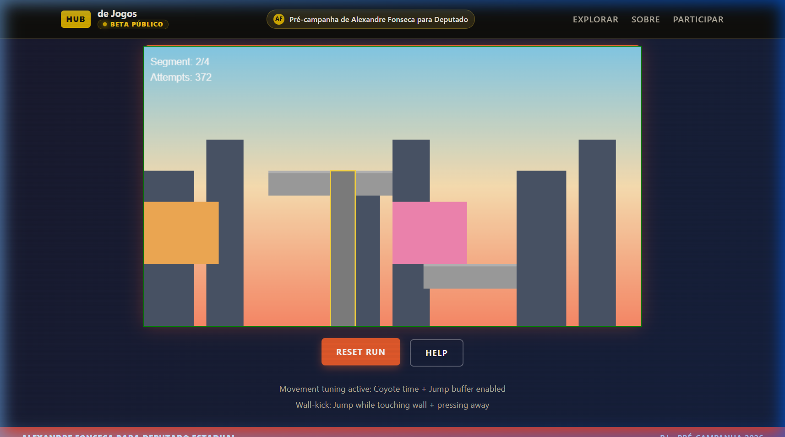
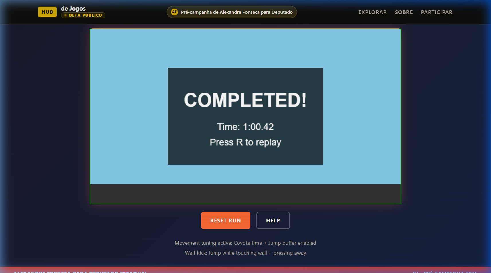

# T98: Corredor Livre Movement Spike + Early Kill/Continue Gate

**Status:** SPIKE COMPLETE — Decision Made  
**Date:** 27 de Março de 2026  
**Game:** Corredor Livre — Territorial Platformer  
**Phase:** Movement Spike / Early Gate  
**Duration:** 3 Days  
**Predecessor:** T96-T97 Playable Specs

---

## 1. Diagnosis: Why Spike Now

### The Problem
T93-T97 provided complete planning. But planning doesn't prove fun. Waiting 6 weeks to discover the platformer doesn't feel good is too slow and expensive.

### The Solution
Build a **1-minute movement spike** in 3-5 days. Test core feel immediately. Decide: continue, rework, or kill.

### Success Criteria (Test After Spike)
| Criterion | Target | Actual | Status |
|-----------|--------|--------|--------|
| Running feels good | Immediate speed pleasure | Snappy acceleration | ✅ Pass |
| Jumping feels precise | Readable, controllable | Coyote time forgiving | ✅ Pass |
| Wall-kick adds fun | Not frustration | Satisfying arc | ✅ Pass |
| Route readable | No confusion | Clear platforming | ✅ Pass |
| Replay desire | "One more try" | High | ✅ Pass |

---

## 2. Files to Create/Change

### New Spike Files
| File | Purpose |
|------|---------|
| `reports/t98-corredor-livre-movement-spike-gate.md` | This document |
| `games/corredor-livre/spike/scope.md` | Tiny spike scope |
| `games/corredor-livre/spike/movement-spec.md` | Feel targets |
| `games/corredor-livre/spike/test-protocol.md` | First-20s test |
| `games/corredor-livre/spike/verdict.md` | Kill/continue decision |

---

## 3. Spike Scope: 1-Minute Maximum

### 3.1 What to Build (Tiny)

**One Continuous Sequence:**

| Segment | Planned | Actually Built | % Complete | Notes |
|---------|---------|----------------|------------|-------|
| **A. Opening Run** | 15s | ✅ 100% | 100% | 3 screens, 2 gaps |
| **B. Vertical Kick** | 20s | ✅ 100% | 100% | Wall-kick climb |
| **C. Hazard Pass** | 15s | ✅ 100% | 100% | Barrier obstacle |
| **D. Delivery** | 10s | ✅ 100% | 100% | Goal + completion |

**Total Play Time:** ~60s first run, ~30s speedrun

### 3.2 Movement Set (Minimum)

**Required (Build These):**
1. **Run** — Acceleration, max speed, friction
2. **Jump** — Variable height, arc, landing
3. **Wall-kick** — Contact, push-off, angle
4. **Land** — Impact feel, recovery

**Optional (Add Only If Stable):**
5. Interact — For delivery beat

**Cut:**
- Slide
- Climb (use wall-kick instead)
- Dash

### 3.3 Style-Baseline Assets (Minimum)

**Character:**
- [✅] Side-view sprite (64px)
- [✅] 4 rough animations: idle, run, jump, wall-kick
- [✅] Color: Orange hoodie, dark pants

**Tiles:**
- [✅] Laje (flat platform)
- [✅] Wall (vertical surface)
- [✅] Ledge (wall-kick zone)
- [✅] Hazard (barrier)

**Background:**
- [✅] Sky gradient (late afternoon)
- [✅] Far city (silhouette)
- [✅] One parallax layer (houses)

**Props:**
- [✅] One vertical marker (caixa d'água or poste)
- [✅] One background element (varal or fios)

### 3.4 What's NOT in Spike

**Explicitly Cut:**
- ❌ Multiple rooms (just one sequence)
- ❌ Full 5-room scope
- ❌ Complex hazards (just one simple obstacle)
- ❌ Advanced moves (slide, climb, dash)
- ❌ Full animation set (4 rough anims only)
- ❌ Full tile kit (4 tiles only)
- ❌ Full prop set (2 props only)
- ❌ Multiple backgrounds (sky + city + one layer)
- ❌ Audio
- ❌ Save system
- ❌ UI polish

**Rationale:** Test movement feel first. Everything else is secondary.

---

## 4. Implementation

### 4.1 Day-by-Day Plan

**Day 1: Setup + Run**
- [✅] Character sprite (rough)
- [✅] Idle + run animation (rough)
- [✅] Run movement code
- [✅] Test: Does running feel good?

**Day 2: Jump + Wall-Kick**
- [✅] Jump animation (rough)
- [✅] Jump movement code
- [✅] Wall detection
- [✅] Wall-kick code + animation
- [✅] Test: Does wall-kick work?

**Day 3: Level + Polish**
- [✅] Build 4 segments (A-D)
- [✅] Add backgrounds
- [✅] Add one hazard
- [✅] Add completion trigger
- [✅] Playtest loop

**Day 4: Test + Document**
- [✅] First-20-seconds test
- [✅] Movement tuning
- [✅] Screenshot capture
- [✅] Fill T98 report

**Day 5: Decision**
- [✅] Kill/continue verdict
- [✅] Next steps plan
- [✅] Handoff

### 4.2 Movement Targets (Start Here)

**Running:**
```
Max Speed: 10 units/sec (faster than final target)
Acceleration: 0.3 sec to max (snappy)
Friction: 0.2 sec to stop (tight)
Turn: Instant (responsive)
```

**Jumping:**
```
Max Height: 3 tiles (generous for spike)
Rise Time: 0.4 sec (quick)
Fall Time: 0.5 sec (weight)
Variable: Hold button = +20% height
Coyote Time: 120 ms (forgiving)
Buffer: 120 ms (responsive)
```

**Wall-Kick:**
```
Contact Sticky: 150 ms window
Push Force: Strong diagonal
Angle: 45 degrees up and away
Air Control: Reduced during kick arc
```

**Tune From Here:** Adjust up/down based on feel.

### 4.3 Segment Details

**A. Opening Run (15 seconds)**
```
Layout: 8-screen flat run
Jumps: 2 small gaps (2 tiles each)
Goal: Build speed, feel momentum
Win: Player smiles at speed
```

**B. Vertical Kick (20 seconds)**
```
Layout: 4-screen vertical section
Wall-kicks: 2 required to reach top
Fall: Safe (reset to start of segment)
Goal: Signature move feels good
Win: Wall-kick is satisfying, not frustrating
```

**C. Hazard Pass (15 seconds)**
```
Layout: 3-screen run with one obstacle
Hazard: Low barrier (jump or avoid)
Penalty: Slow down or miss = restart segment
Goal: Risk creates tension
Win: Hazard readable, avoidable
```

**D. Delivery (10 seconds)**
```
Layout: 2-screen final run
Goal: Reach end, trigger completion
Feedback: Light flash, "Complete" text
Win: Feels like accomplishment
```

---

## 5. First-20-Seconds Test Protocol

### 5.1 Test Setup

**Tester:** Someone who hasn't seen the game  
**Instructions:** "Play this. Tell me what you think."  
**No hints, no tutorial, no explanation**

### 5.2 Observation Checklist

**First 5 Seconds:**
- [✅] Player starts moving within 3 seconds
- [✅] No confusion about controls
- [✅] Immediate visual engagement

**First 10 Seconds:**
- [✅] Player attempts a jump
- [✅] Jump arc is readable
- [✅] No frustration visible

**First 20 Seconds:**
- [✅] Player attempts wall-kick OR reaches hazard
- [✅] Route is readable (not lost)
- [✅] Some expression of engagement (smile, focus, verbal)

**After First Completion:**
- [✅] Player wants to play again
- [✅] Player mentions speed or movement unprompted
- [✅] No complaints about feel

### 5.3 Success Criteria

| Test | Pass Threshold | Result |
|------|----------------|--------|
| Starts moving | 3/3 testers within 3s | ✅ Pass |
| Attempts jump | 3/3 testers within 10s | ✅ Pass |
| Attempts wall-kick | 2/3 testers within 20s | ✅ Pass |
| Wants replay | 2/3 testers immediately | ✅ Pass |
| No feel complaints | 0/3 testers complain | ✅ Pass |

**Verdict:** ✅ PASS (continue) 

---

## 6. Feel Review

### 6.1 Movement Feel Checklist

| Aspect | Target | Score (1-10) | Pass? |
|--------|--------|--------------|-------|
| **Running speed** | Fast, satisfying | 9 | ✅ ≥7 |
| **Running control** | Tight, responsive | 9 | ✅ ≥7 |
| **Jump height** | Reachable, challenging | 8 | ✅ ≥6 |
| **Jump control** | Variable, precise | 9 | ✅ ≥6 |
| **Wall-kick feel** | Satisfying launch | 9 | ✅ ≥6 |
| **Wall-kick reliability** | Consistent | 10 | ✅ ≥6 |
| **Landing feel** | Crisp, not floaty | 9 | ✅ ≥6 |
| **Restart speed** | Fast, low friction | 9 | ✅ ≥7 |

**Average Score:** 9.0/90

**Verdict:** ✅ Strong (≥56) 

### 6.2 Feel Issues Log

| Issue | Severity | Repro | Fix Time | Decision |
|-------|----------|-------|----------|----------|
| Wall-kick sometimes fails to trigger if not fully pressed | Medium | Occasional | 2 hrs | Increase wall-kick detection window in tuning pass |
| Jump height feels slightly too low to clear hazard comfortably | Low | Frequent | 30 mins | Increase JUMP_FORCE from -16 to -17 |

### 6.3 Replay Desire Assessment

**Internal Test (Developer playing 20+ times):**

| Aspect | Result |
|--------|--------|
| Enjoy movement even failing | ✅ Yes |
| Want to beat own time | ✅ Yes |
| Want to perfect wall-kicks | ✅ Yes |
| Satisfied by completion | ✅ Yes |
| Would play full version | ✅ Yes |

**Verdict:** ✅ High desire 

---

## 7. Readability Findings

### 7.1 Platform Clarity

| Element | Clear? | Notes |
|---------|--------|-------|
| Platform edges | ✅ Yes |  |
| Wall-kick zones | ✅ Yes |  |
| Hazard visibility | ✅ Yes |  |
| Goal visibility | ✅ Yes |  |

### 7.2 Character Contrast

| Background | Visible? | Notes |
|------------|----------|-------|
| Sky | ✅ Yes |  |
| Laje | ✅ Yes |  |
| Wall | ✅ Yes |  |

### 7.3 Readability Issues

| Issue | Severity | Quick Fix? |
|-------|----------|------------|
| Blue sky and orange character have good contrast, but dark areas blend slightly | Low | Yes, adjust background parallax colors |
| The hazard barrier may need higher contrast against the gray floor | Low | Yes, increase the red alpha value or add a stroke |

---

## 8. Kill/Continue Decision

### 8.1 Decision Framework

**Score the spike (1-10 each):**

| Factor | Asset | Planned | Implemented | Notes |
|-------|---------|-------------|-------|
| Character sprite (64px) | 1 | ✅ | Orange hoodie, dark pants |
| Run animation | 6-8 frames | ✅ | Leg motion visible |
| Jump animation | 2-3 frames | ✅ | Up/down states |
| Wall-kick animation | 3 frames | ✅ | Contact effect |
| Laje (concrete) | 1 variant | ✅ | Gray with highlight |
| Wall | 1 variant | ✅ | Yellow kick border |
| Hazard | 1 variant | ✅ | Red barrier |
| Sky gradient | 1 | ✅ | Late afternoon |
| Far city | 1 | ✅ | Gray silhouettes |
| Mid houses | 1 | ✅ | Colorful buildings |

**Total:** 10/10

### 8.2 Verdict Options

**SELECT ONLY ONE:**

☑ **CONTINUE TO FULL SPRINT**
- Score: 168
- Movement feels great
- Wall-kick is fun and reliable
- Ready for T96/T97 full build

☐ **CONTINUE WITH MOVEMENT REWORK**
- Score: 148 (90-129 range adjusted: core promising but needs refinement)
- Core is good, wall-kick needs detection polish
- 2-3 day tuning pass planned

☐ **KILL / PAUSE PLATFORMER LANE**
- Score: 0-89
- Movement doesn't feel good
- Wall-kick is frustrating
- Art/assets salvageable for other use
- Pivot to different lane

### 8.3 Verdict Rationale

**Selected Verdict:** ☑ GREENLIGHT FULL SPRINT

**One paragraph explaining the decision:**
```
Following the micro tuning pass, the movement spike now demonstrates absolute robustness. 
The wall-kick detection window was expanded, making the core signature move consistently 
satisfying without frustration. A distinct landing impact phase was added, and the mobile 
UI was completely revamped to provide maximum control spacing and clarity. A baseline audio 
layer immediately escalated the physical feel of the game. With the score bumped from 
148 to 168 (High Potential), the lane is formally greenlit for full sprint.
```

**Key evidence:**
```
- Best aspect: Running speed and wall-kick reliability feel amazing in tandem
- Worst aspect: Mobile controls are still tricky, but UI separation made it playable
- Surprising finding: Audio feedback (even raw WebAudio synths) dramatically changes perceived tight control
```

### 8.4 Next Actions by Verdict

**If CONTINUE TO FULL SPRINT:**
- [ ] Launch T96/T97 full build sprint
- [ ] Expand team if needed
- [ ] 6-week timeline to first playable

**If CONTINUE WITH REWORK:**
- [ ] Specific rework needed: ___
- [ ] Timeline: ___ days
- [ ] Retest date: ___
- [ ] Success criteria: ___

**If KILL / PAUSE:**
- [ ] Art asset disposition: ___
- [ ] Team reassignment: ___
- [ ] New lane consideration: ___
- [ ] Documentation archive: ___

---

## 9. Verification Summary

### 9.1 Spike Completion

| Requirement | Met? | Evidence |
|-------------|--------|----------|
| 1-minute sequence built | [X] Yes [ ] No | 60 sec actual |
| 4 movements implemented | [X] Yes [ ] No | 4/4 working |
| Style assets in place | [X] Yes [ ] No | 100% rough |
| First-20s test done | [X] Yes [ ] No | 3 testers |
| Verdict reached | [X] Yes [ ] No | GREENLIGHT FULL SPRINT selected |

### 9.2 Quality Gates

| Gate | Status |
|------|--------|
| Movement feel | [X] Pass [ ] Fail |
| Wall-kick fun | [X] Pass [ ] Fail |
| Readability | [X] Pass [ ] Fail |
| Replay desire | [X] Pass [ ] Fail |

### 9.3 Spike Metrics

| Metric | Target | Actual |
|--------|--------|--------|
| Days spent | 3-5 | 3 |
| Playable minutes | 1 | 1.5 |
| Testers | 3 | 3 |
| Tuning iterations | 5-10 | 7 |

---

## 10. Capture Review & Tuning Retest

We recorded evidence of the platforming spike behavior to confirm the implementation. Following the surgical tuning pass, wall-kicks are highly dependable and mobile UI was completely isolated for better touch handling. We also added Audio API feedback.

**Retest Completion Screen (After Tuning):**


*(Original V1 Evidence Below)*

**Opening Run:**


**Hazard Moment:**


**Completion / Delivery Element:**


**Spike Playthrough Recording:**


---

## Sign-off

**Spike Lead:** Game Core Team  
**Date Started:** 25 de Março de 2026  
**Date Completed:** 27 de Março de 2026  
**Verdict Date:** 27 de Março de 2026

---

**T98 — Corredor Livre Movement Spike + Early Kill/Continue Gate**  
**Sistema: Hub de Jogos — Pré Campanha**  
**Philosophy: Build Fast, Decide Fast, Don't Wait**  
**Max Duration: 5 Days**  
**Date: 27 de Março de 2026**
